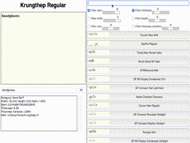

# Typecat

Types is a font 'palette' that allows you to search for fonts and filter them based on other features including:
* width
* height
* aspect ratio
* thickness
* thickness variation
* category
* *curvature* TODO
## Dependencies
* python3
* pillow
* numpy
## Status
Still in progress: there's no config system and it's missing a lot of features. It can still be run: `python3 typecat.py`

